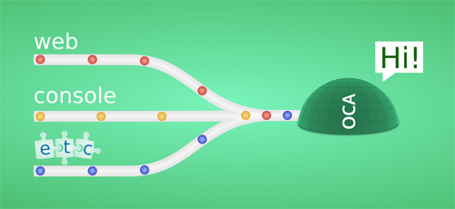

<p align="center">
  
</p>

[](https://gitter.im/node-oca)
[](https://travis-ci.org/node-oca/oca)
[](https://codecov.io/github/node-oca/oca?branch=master)
[](https://node-oca.github.io/)
[](https://snyk.io/test/github/node-oca/oca)
</p>

Oca provides an execution agnostic platform that takes care much of the common routines ([DRY](https://en.wikipedia.org/wiki/Don%27t_repeat_yourself)) necessary to
get features of your application available accross different forms of execution through
an API that emphasizes reliability and extensibility. Oca is intended to be used across
a broad spectrum of applications.

By using Oca you write once, get it easily accessible anywhere!

<p align="center">
  
</p>

## Key features
- Flexible architeture
- Express integration
- Authentication integration through passport
- Full file upload support
- Middleware actions
- Auto RESTful support
- Integrated caching system
- JSON serialized actions

## Documentation
- [Introduction](https://github.com/node-oca/oca/blob/master/data/manual/INTRODUCTION.md)
- [API reference](https://node-oca.github.io)
- Tutorials (coming soon)
- Examples (coming soon)

## Requirement
Oca is built using modern specs [ES6](http://es6-features.org/)/ES7, it requires Node.js version **6 or greater**

## Install
```
npm install oca --save
```

## Getting help
Use the GitHub issues for tracking bugs and feature requests Also, feel free to talk about Oca at:
- Gitter [node-oca](https://gitter.im/node-oca)
- IRC #node-oca on chat.freenode.net

## Issues
Oca development discussions and bug reports are collected on [Issues](https://github.com/node-oca/oca/issues)

## Contributing
Contributions are welcome to Oca. It can be made through many different forms depending on your level of interest:
- Participating in gitter/irc discussions
- Proposing features
- Reporting issues
- Making improvements (adding new features, improving the existing features, adding tests,
adding examples, clarifying wording and fixing errors)

## Acknowledgements
Oca was heavily inspired by concepts found in the technologies below:
- [Passport](https://github.com/jaredhanson/passport)
- [Cortex](https://github.com/ImageEngine/cortex)
- [Express](http://expressjs.com)

## Licensing
Oca is free software; you can redistribute it and/or modify it under the terms of the MIT License
